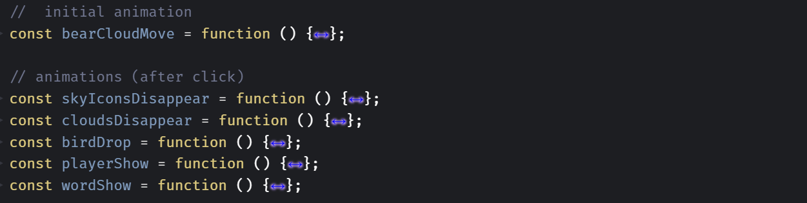
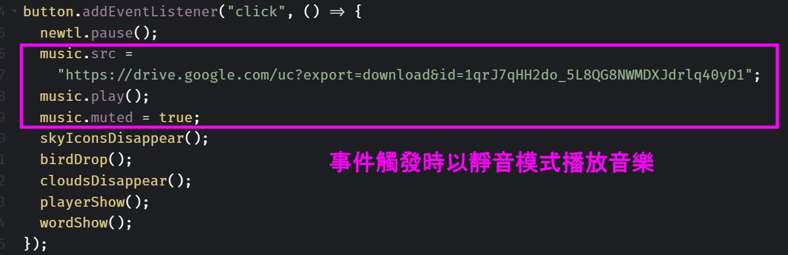
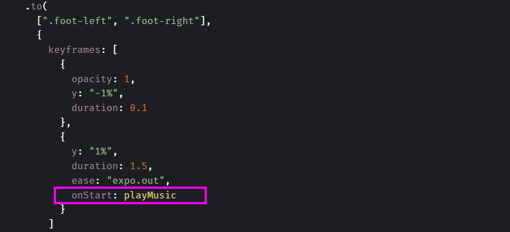

# Birthday Birds：生日動態卡片
## 專案緣起
在參加六角學院2022辦的黑客松F2E時，曾嘗試使用GSAP中的scrollTrigger將scroll與動畫做連結，但發現自己對GSAP的基礎語法不夠熟練，能做出的效果有限，所以決定從GSAP的基礎開始練習。剛好適逢朋友生日，於是就試著用GSAP做出這次的專案。

## 專案介紹
生活、回憶就像旅行，會在不同場所之間轉換。想結合「旅行」這個概念，讓使用者跟著小鳥們一起短暫旅行，並在旅途結束時，收到生日的祝福。


#### 註：畫面延遲為螢幕錄影造成，實際成果請至codepen觀看！

<br>

由於這次專案的目的主要是練習GSAP語法，且是單頁式的網站，因此採用codepen作為開發環境，github作為網頁發布與記錄主要版本的平台，若想看最新的語法可以到<a href="https://codepen.io/anstice-lin/pen/BaVXZaw">codepen</a>觀看。

## 技術與環境
主要在codepen進行開發，並採用pug、scss和javascript作為開發語言，並以GSAP製作動畫效果。

## 專案重點與設計
### 1. GSAP timeline 應用：
此次專案的動畫具有連續性，為了統一管理動畫的順序及維持程式碼的整潔、可維護性，採用gsap的timeline安排動畫。動畫主要分為兩個部分：start按鈕觸發前的動畫以及start按鈕觸發後的動畫，而按鈕觸發後的動畫又依據功能儲存在變數中。

```程式碼截圖：```


<br>

在動畫時間安排上，也利用position parameter(如"<"")安排，增加動畫的易改性。

### 2. audio播放與行動端系統相容性：
先前曾經做過另一個結合音檔的專案<a href="https://github.com/Ansticefish/music-forest">(專案連結)</a>，當時透過vue的資料綁定特性，將資料與audio的v-if標籤綁定，控制音樂的播放與否。原本希望像之前的做法，透過改變audio的display值來播放音樂，但在閱讀audio文件後，決定採用audio.play()這個更直接的方式播放。

此外。在這次專案中，為了讓音樂播放器看起來更真實，並製造出「小鳥觸發音檔播放」的效果，因此將音樂播放的時間點安排在小鳥降落之後以及音樂播放器的物件開始移動的時候。

由於行動端對於音樂播放延遲時間有限制，為了讓音樂在行動端也能順利播放，最後選擇在start按鈕被觸發時就先以靜音的方式播放音樂(如下圖一)，再利用gsap的onComplete callback在想要的時間點播放音樂(如下圖二)。
<br>

```圖一：```

<br>

```圖二：```


### 3. 統一網頁reload後的scroll位置
在動畫播放完畢後，網頁的scroll位置會改變，因此在頁面重新整理之後，會因為瀏覽器預設的scroll位置初始行為不同而造成網頁的位置跑版。因此加入以下程式碼，統一將reload後的scroll位置設在頁面頂端。


